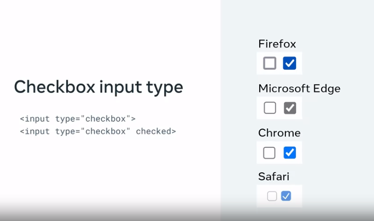

# Browser Differences

An important part of being a front-end developer is to provide a good user experience on the websites and web applications that you develop, That includes ensuring that users can complete HTML forms without issues. there are many web browsers available today for browsing  the World Wide Web. however, each one is developed by a different company using different technologies. 

As a result, you will find that your HTML forms will appear differently when you view them on different web browsers. But a form may even appear differently on the same browser when you view the form in a Windows PC or a Mac. this makes the creation of a consistent user experience challenging. 

```html
<input type = "text" value="Username">
```

There are subtle differences in input fields such as this one in different browsers. Such as different widths and borders

```html
<input type ="checkbox">
<input type ="checkbox" checked>
```



If you edit you form stylings in CSS, you can ensure a consistent user experience across all browsers and devices.